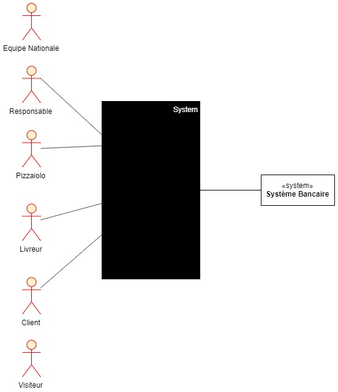
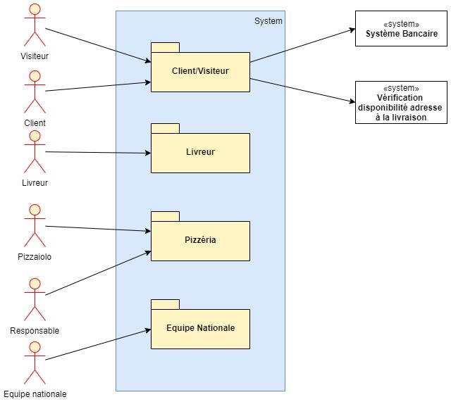

# Analyse Besoin et identification acteurs et tâches

## Acteurs

- Responsable
- Pizzaiolos
- Livreurs
- Client
- *Gestionnaire de commande?*
- *Administrateur système?*
- Système de gestion
- Système bancaire

**Questions**
- Qui effectuera la gestion des commandes au sein de la pizzéria? (Récupération des commandes passées, changement d'état vers en préparation et à livrer)
- Le responsable est-il l'administrateur du système ou est-ce un acteur à part entière?

## Tâches

- **Responsable doit pouvoir**
  - Accéder au suivi des commandes en temps réel (passées, en préparation et en livraison)
  - Accéder au stock d'ingrédients restants pour savoir quelles pizzas peuvent encore être réalisées
- **Pizzaiolo doit pouvoir**
  - Voir commande à préparer, changer état commande (en préparation, à livrer)
  - Accéder au stock d'ingrédients restants pour savoir quelles pizzas peuvent encore être réalisées
  - Accéder à un aide-mémoire indiquant la recette de chaque pizza
- **Livreur doit pouvoir**
  - Changer état d'une commande pour indiquer sa livraison
- **Client doit pouvoir**
  - Commander
    - en ligne
    - au téléphone
    - sur place
  - Payer
    - en ligne
    - à la livraison
  - Modifier ou annuler une commande qui n'est pas en préparation

**Questions**
- Possibilité pour le client de se connecter pour garder ses informations en mémoire? (voir son historique de commandes?)
- Gestion des droits utilisateurs? (Peut-être un peu tôt)

- **Package Gestion de Commande:**
    - Interface Web
        - Passage de commande
        - Suivi commande
        - Modification commande
        - Annulation commande
        - Paiement commande
    - Interface interne
        - Suivi état commande (à traiter, en préparation, à livrer, en livraison, livrée)
        - Changement état commande (à traiter, en préparation, à livrer, en livraison, livrée)
    
- **Package Gestion Générale:**
    - Suivi stock ingrédients
    - Aide-Mémoire recettes de pizza
    - Administration? (droits utilisateurs)