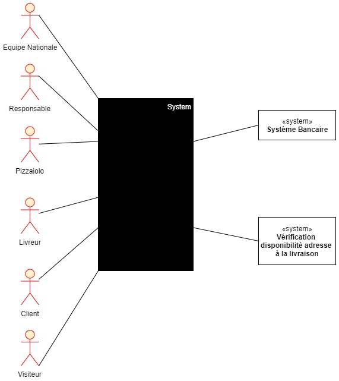

# Analyse Besoin et identification acteurs et tâches

## Acteurs

- Responsable
- Pizzaiolos
- Livreurs
- Client
- Système bancaire
- Equipe Nationale

**Questions** 
- Aucune

## Packages et Tâches

### Package Interface Equipe Nationale

### Package Equipe Nationale

- **Equipe Nationale doit pouvoir**
  - Se connecter
    - Consulter les commandes en cours peut importe leur état, y compris les commandes livrées
    - Consulter l'état du stock d'ingrédients
    - Gérer les droits utilisateurs (administration)

### Package Interface Equipe Pizzéria

- **Responsable doit pouvoir**
  - Se connecter
    - Consulter les commandes en cours peut importe leur état
    - Modifier l'état d'une commande ('en cours de préparation, 'à traiter')
    - Consulter l'Aide-mémoire de recettes de pizza
    - Consulter l'état du stock d'ingrédients
    - Gérer les droits utilisateurs (administration)
- **Pizzaiolo doit pouvoir**
  - Se connecter
  - Consulter les commandes à traiter
  - Modifier l'état d'une commande ('en cours de préparation, 'à traiter')
  - Consulter l'Aide-mémoire de recettes de pizza
  - Consulter l'état du stock d'ingrédient?

### Package Interface Livreur

- **Livreur doit pouvoir**
  - Se connecter
  - Consulter commandes à livrer
  - Changer état commander en "Livrée"
  - Récupérer Paiement Commande

### Package Interface Client

- **Visiteur doit pouvoir**
  - Consulter catalogue recettes
  - S'incrire
  - S'identifier

- **Client doit pouvoir**
  - Sélectionner produits
    - Valider commande
    - Choisir mode  paiement
      - Payer en ligne
      - Payer à la livraison
    - Vérifier état commande
      - Modifier commande tant que pas "en préparation"
      - Annuler commande tant que pas "en préparation"

